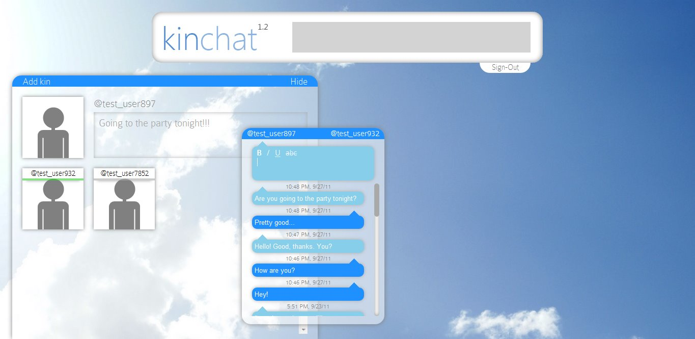
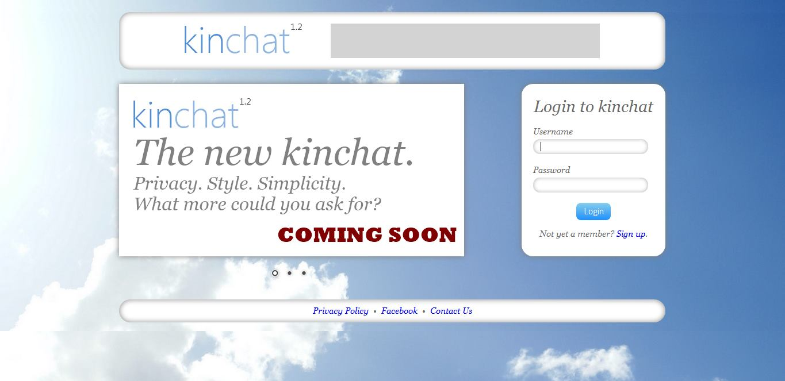
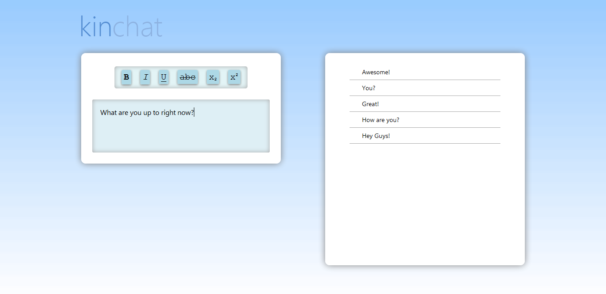
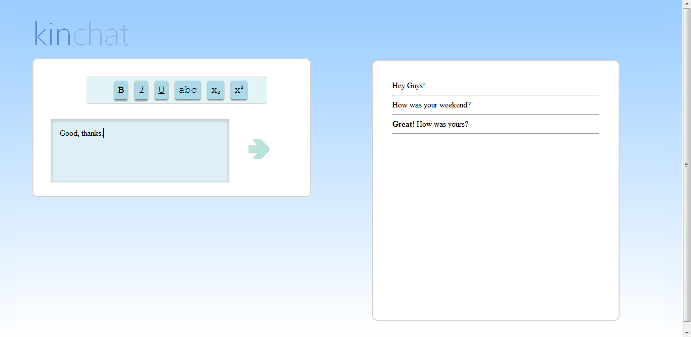

# kinchat

kinchat is a free, rich-text chat client based in PHP, from circa 2011. A demo is available to view on [YouTube](https://www.youtube.com/watch?v=rdCnedrxslk).

## Configuration

1. TODO: Write instructions for MySQL database setup.
2. PHPMailer is a PHP class to automate and improve sending emails. In kinchat, it's used to send users emails to confirm their account, send and accept invitations to add kin (friends), and more. The latest version as of writing is 5.2.7, while the version used in kinchat 1.2 is 5.0.0. Instructions to setup the latest version of PHPMailer may be found [here](https://github.com/PHPMailer/PHPMailer/blob/master/README.md). While there may be some discrepancies in the API, the API of the older version should conincide with much of the current documentation. All configuration settings for PHPMailer may be found in the /PHPMailer directory.

## Evolution

### v1.2 beta

### v1.1

### v1.0

